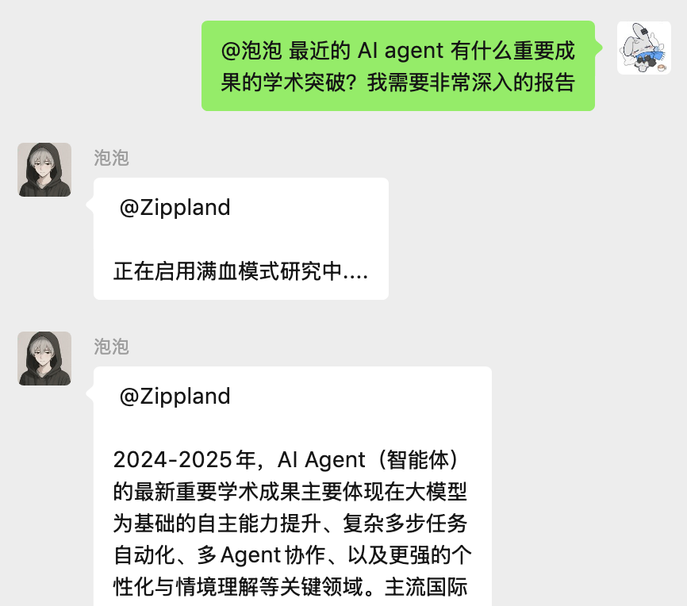

<div align="center">

# 🫧 Bubbles - WechatAI 🫧

*我叫 泡泡（Bubbles） - 一个致力于链接身边万物的个人助手*

</div>

<p align="center">
  
  
  
  
</p>

> ✉️ 致来访者
>
> 我一直在尝试做一个全面的的生态助手（个人助理），能够连接我使用的任何工具、日程表、数据库、资料库。并基于数据资料，实时地和我交流，以及帮我安排日程、提醒、规划时间和出行，安排我的任务计划。甚至于查资料、做研究、处理工作、回老板微信（帮我上班）。
>
> 之前做了 [LifeSync-AI](https://github.com/Zippland/LifeSync-AI) 这个项目，核心思想是基于 Github Action、Notion、Zapier进行app互联，帮我进行每天的任务规划。但定时任务是被动的，而且缺少一个统一的数据处理中心，所以无法通过与用户交流进行实时的任务调度。
>
>于是我在好奇，是否能使用聊天工具，通过和AI直接对话的形式，再通过 function call 或者 MCP Server 链接到工具，进而链接我的所有需求。
>
> **这就是这个项目的初衷。**
>
> 玩得开心，
>
> Zylan
>


## 📝 项目简介

Bubbles 是一个功能丰富的微信机器人框架，基于 [wcferry](https://github.com/lich0821/wcferry) 和 [WechatRobot](https://github.com/lich0821/wechatrobot) 开发，支持接入多种LLM，提供丰富的交互功能和定时任务。该项目旨在将微信客户端转变为一个智能的个人助手，可以执行多种实用功能，带来便捷的用户体验。

和一般机器人框架不同的是，Bubbles 构建了一套基于 AI 的智能路由系统：AI 会读取所有已注册的功能描述，自动判断用户想要执行的操作并调用对应的处理函数。添加新功能时，只需要编写处理逻辑并通过装饰器注册到 AI 路由，无需在消息处理流程里额外写分支逻辑。

这套路由机制是项目的核心，使得机器人可以在保持主线稳定的同时，快速接入数量众多、类型各异的工具。已实现的功能示例见 **如何添加新功能** 章节。

## 🔩 更新日志

- 2025-10-29 支持在群里 /set /persona 来设置群聊的人设
- 2025-10-23 赋予 AI 可以主动进行回复的能力
- 2025-10-13 由 AI 自主判断回复需要用 flash 还是 resoning 的模型
- 2025-10-13 赋予 AI 可自由查看历史记录的能力（关键词搜索、时间轴搜索、偏差搜索）
- 2025-09-25 支持完全的 Agentic Routing 驱动，无需触发词
- 2025-09-18 支持通过 “想想” 触发 resoning 的模型，DeepResearch 的思考深度由 AI 判断
- 2025-05-12 新增提醒、日程管理功能
- 2025-05-01 支持 DeepResearch
- 之前的就先不记录了

## 案例演示
#### 案例演示：使用自然语言设置提醒（AI 智能路由）

结构：

用户输入 -> AI 路由决策 -> 满足功能要求 -> agent格式化输出 -> 格式解析 -> 函数调用 -> 接口访问 -> 查询数据 -> 数据库持久化 -> 结果回调

   


## ✨ 核心特性

#### 🤖 灵活的模型配置
- 支持为不同的群聊和私聊设置不同的 AI 模型和 system prompt
  - OpenAI (ChatGPT)
  - DeepSeek

#### 🛠️ 智能路由系统
- 基于 AI 的意图识别，无需记住特定命令格式
- 支持为功能提供描述、示例和参数说明，帮助模型精准调用
- 通过装饰器注册新功能即可扩展机器人能力

消息处理流程说明：
1. **消息预处理**：系统接收用户消息，提取纯文本、发送者等上下文
2. **权限判断**：仅在私聊或群聊中被 @ 时才进入 AI 路由，避免打扰其他群成员
3. **AI 决策**：大模型根据功能描述判断是否调用某个功能或直接聊天
4. **结果输出**：调用成功的功能会返回处理结果，否则使用默认闲聊响应

### ⏰ 定时任务与提醒功能
- 每日天气预报推送
- 每日新闻资讯推送
- 工作日报/周报/月报提醒
- 个人自定义提醒系统（通过自然语言设置定时提醒）

### 📊 对话管理
- 不管是群里的消息还是自己的消息，都本地写入 sql 队列中（长度可自定义）
- 智能消息总结功能
- 处理各类微信消息（文本、图片、小程序、链接等）

#### 🔧 实用工具
- 自动接受好友请求并打招呼（可通过 `auto_accept_friend_request` 配置开启）
- 自动响应群聊和私聊消息

## 🛠️ 安装指南

#### 系统要求
- Python 3.8 或更高版本
- Windows 操作系统（wcferry 要求）
- 微信 PC 版客户端
- 云配置要求（如需）：2vCPU 2GiB （经济型）

#### 安装步骤

1. **克隆仓库**
   ```bash
   git clone https://github.com/zippland/Bubbles.git
   cd Bubbles
   ```

2. **创建并激活虚拟环境（可选但推荐）**
   ```bash
   python -m venv .venv
   .venv\Scripts\activate
   ```

3. **安装依赖**
   ```bash
   pip install -r requirements.txt
   ```

4. **配置项目**
   ```bash
   # 复制配置模板
   cp config.yaml.template config.yaml
   
   # 编辑配置文件，填入您的 API 密钥等信息
   notepad config.yaml
   ```

## ⚙️ 配置说明

配置文件 `config.yaml` 包含以下主要部分：

#### AI 模型配置

每个 AI 模型都有自己的配置部分，例如：

```yaml
# ChatGPT 配置
CHATGPT:
  key: "your-openai-api-key" # 填写你 ChatGPT 的 key
  api: "https://api.openai.com/v1"
  model: "gpt-4.1-mini"  # 可选：gpt-4, gpt-3.5-turbo 等
  proxy: "http://127.0.0.1:7890"  # 可选：如需代理请填写
  system_prompt: "你是一个有用的助手。"
  max_history_messages: 20 # 设置 ChatGPT 默认最多回顾 20 条历史消息
```

#### 群组/私聊模型映射

您可以为不同的群聊或私聊指定不同的 AI 模型：

```yaml
# 群组模型配置
GROUP_MODELS:
  # 默认模型 ID
  default: 1  # 1 代表 CHATGPT
  
  # 群聊模型映射
  mapping:
    - room_id: "12345678@chatroom"  # 群聊 ID
      model: 1  # 1 代表 CHATGPT
      max_history: 30  # 回顾最近30条消息

  # 私聊模型映射
  private_mapping:
    - wxid: "wxid_abc123"  # 用户 wxid
      model: 2  # 2 代表 Deepseek
      max_history: 50  # 回顾最近50条消息
```

#### 群聊随机闲聊回复

如果希望机器人在群聊中偶尔主动开聊，可在 `groups.models.mapping` 中为群添加 `random_chitchat_probability`：

```yaml
groups:
  models:
    mapping:
      - room_id: "12345678@chatroom"
        model: 2
        max_history: 30
        random_chitchat_probability: 0.3  # 0-1，0 表示关闭
```

`random_chitchat_probability` 表示该群的上限概率。命中一次后会直接清零，随后每条符合条件的群消息自动 +0.05 逐步回升，直至回到上限；未配置该字段的群默认关闭随机闲聊。

#### 功能开关

您可以启用或禁用各种功能：

```yaml
# 功能开关
  news_report # 每日新闻推送
  weather_report  # 每日天气推送
  image_generation  # AI生图
  perplexity  # perplexity
```

## 🚀 使用方法

#### 启动机器人

```bash
python main.py
```

#### 可用功能示例（AI 路由）

以下是已经注册到 AI 路由的典型意图，机器人会尽力理解类似的自然语言表述：

##### 提醒功能
- “提醒我明天下午三点开会” —— 设置一次性提醒
- “每天早上 8 点提醒我跑步” —— 支持循环提醒
- “查看我的提醒” / “我有哪些提醒” —— 查看当前所有提醒
- “把明天的开会提醒删掉” —— 删除指定提醒

##### 搜索与资讯
- “帮我查查最近的 AI 新闻” —— 使用 Perplexity 进行深度检索
- “看看今天的新闻” —— 推送最新要闻

##### 天气工具
- “北京天气怎么样”
- “查一下上海未来几天的天气”

## 📋 项目结构

```
Bubbles-WechatAI/
├── ai_providers/       # AI 模块
│   ├── ai_name.py      # AI 模型接口实现
│   └── ...
├── commands/           # 消息上下文与 AI 路由
│   ├── handlers.py     # 功能处理函数
│   ├── ai_router.py    # AI智能路由器
│   ├── ai_functions.py # AI路由功能注册
│   └── ...
├── data/               # 数据文件
│ 
├── function/           # 功能模块
│   ├── func_feature.py # 各种功能的具体实现
│   └── ...
├── config.yaml         # 配置文件
└── ...
```

### ✨ 如何添加新功能

目前所有新功能均通过 AI 智能路由接入，开发流程如下：

1. **实现功能逻辑**
   * 在 `function/` 目录下创建或复用功能模块，封装核心业务逻辑，便于测试和复用。

2. **注册 AI 路由功能**
   * 打开 `commands/ai_functions.py`
   * 使用装饰器注册功能，提供给模型判定意图所需的描述信息：
   ```python
   @ai_router.register(
       name="your_function_name",
       description="功能描述（AI 会根据这个判断用户意图）",
       examples=[
           "示例用法1",
           "示例用法2",
           "示例用法3"
       ],
       params_description="参数说明"
   )
   def ai_handle_your_function(ctx: MessageContext, params: str) -> bool:
       # params 是 AI 从用户输入中提取的参数
       # 调用你的功能逻辑
       # 使用 ctx.send_text() 发送回复
       return True
   ```

3. **理解路由机制**
   * 用户消息会在私聊或被 @ 时进入 AI 路由
   * AI 根据 `description`、`examples` 和 `params_description` 选择最合适的功能
   * `params` 字段由模型提取，可根据需要进一步解析或校验

例如，注册了天气查询功能后，用户可以说：
- "北京天气怎么样"
- "查一下上海的天气"
- "明天深圳会下雨吗"

AI 都能理解并调用天气查询功能。

完成以上步骤后，重启机器人即可测试你的新功能！

## 📄 许可证

本项目采用 Apache 2.0 许可证，详情请参阅 [LICENSE](LICENSE) 文件。

## 🙏 致谢

- [wcferry](https://github.com/lich0821/wcferry) - 提供微信机器人底层支持
- 所有贡献者和用户

## ❓ 常见问题

**Q: 如何获取群聊 ID？**
A: 在群聊中发送一条消息，机器人日志会显示该消息的来源群聊 ID。

**Q: 如何添加新的 AI 模型？**
A: 在 `ai_providers` 目录下创建新的模型接口实现，然后在 `robot.py` 中注册该模型。

**Q: 出现 "AI 模型未响应" 错误怎么办？**
A: 检查相应 AI 模型的 API 密钥配置和网络连接，确保 API 可访问。

**Q: 机器人不回复消息怎么办？**
A: 检查 wcferry 服务是否正常运行，查看日志文件了解详细错误信息。

## 📞 联系方式

如有任何问题或建议，请通过以下方式联系我们：

- GitHub Issues: [提交问题](https://github.com/zippland/Bubbles/issues)
- Email: zylanjian@outlook.com

---

**注意**：本项目仅供学习和个人使用，请遵守微信使用条款，不要用于任何违反法律法规的活动。
